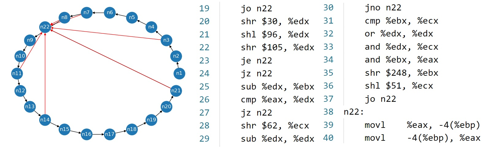
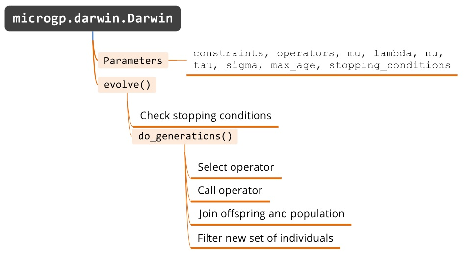
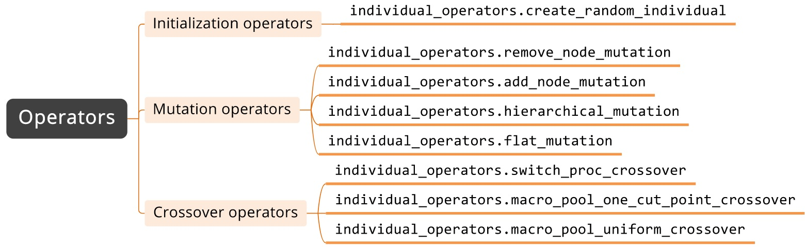
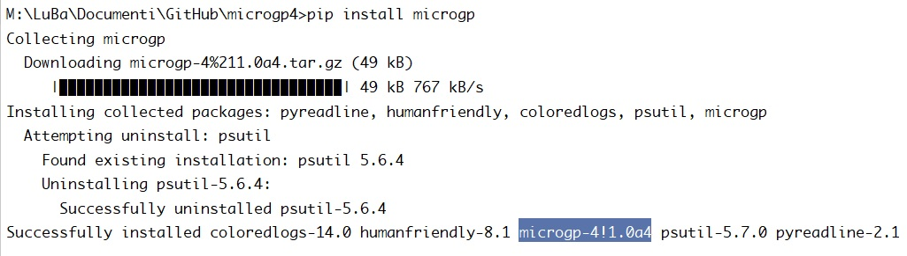

"""""""
Summary
"""""""

Abstract
========

**MicroGP** is an optimizer that exploits Evolutionary
Computation to find optimal solutions to hard problems. The thesis
consists in the complete re-design of the toolkit and in the new
implementation in Python language.

1. The goal of the thesis
*************************

MicroGP was created almost 20 years ago to generate assembly-language
programs used to test microprocessors. The project has evolved in the
following years improving the flexibility, usability and
functionalities. C and then C++ language was used for the
implementation.

The thesis philosophy is to analyze errors and shortcomings of the
previous versions which lead to a complete re-design of the tool. At
first, defining the individual's structure and using the evolutionary
parts required an enormous effort that only an expert programmer could
handle. The goal has been to build a simpler and more dynamic
evolutionary tool increasing the number of users. As a result, we have
selected Python language because it is easy, flexible and highly
supported by its community. In order to use the tool, the user only
needs to know the Python syntax to define the individuals and genetic
operators.

2. Introduction to Evolutionary Computation
*******************************************

Evolutionary Computation is a branch of **Computational Intelligence**
that consists in iterative optimization of solutions inspired by
biological evolution. The kind of algorithms called Evolutionary
Algorithms (EA) starts from a bunch of randomly generated solutions and
applies a set of operators leading eventually to the optimal ones. The
solutions are typically represented with a certain format called
*genotype* and their physical representation is called *phenotype*

Left: Genotype of the solution. Right: Phenotype of the solution

3. New Design
*************

An individual is a directed multi-graph in which the information is encoded in
its nodes and edges (*genotype*). The **instruction library**, is used
to define the individuals' structure reducing the search space through
smart decisions. It is composed by **sections** that contain one or more
**macros** (text with zero or more **parameters**). The class called ``Constraints``
stores the instruction library and the properties. **Properties** are
boxes that can contain values and checkers that run tests on the values.
The user can perform any kind of check passing user-defined functions.
They are run during each validation phase of any solution.

An individual is composed by **frames** that are unique instances of
sections. The solutions evaluator can be a Python method, or a script
run by an external program/machine.

The evolution process has been implemented in the *Darwin* class.
Size of the population, initial population
size, number of genetic operators used at each generation and other
evolution parameters are passed during the creation of this object. A
set of genetic operators is passed to *Darwin*, they can be the ones
provided by the package or user defined methods. The evolution logic
handles efficiently the selection of operators and manages the
population keeping the best solutions in an archive that is updated at
each generation.

Darwin class evolution logic and parameters.

The **parameters** are used to make macros dynamic and describe some
individuals genes. They can be of several types: integer, bitstring,
categorical, ordered categorical, local reference or external reference.
The *reference* parameters act on the edges of the graph linking nodes
together. The integer parameter can take a range of values specifying
minimum and maximum. During the creation of the categorical and ordered
categorical parameters types the user defines a set of alternatives. The
bitstring parameter generates strings of bits with the specified length.

MicroGPv4 offers eight basic **genetic operators**.
Three of them are **crossover operators** (or
recombination operators), four are **mutation operators**. The last has
the goal to **create a random individual** starting from the
user-defined instruction library. The initialization differs from the
other EAs libraries because usually the logic implementing the creation
of the solution is detached from the set of the genetic operators.

One of the mutation operators mutates the graph inserting a new node
that contains a valid macro, on the contrary, another operator removes a
node from the graph. The remaining mutation operators mutate the values
of the parameters inside one or more macros. The operator called ``switch_proc_crossover`` copies
a particular sequence of nodes from an individual to another one. The
other recombination operators swap one or more nodes between two
individuals.

Genetic operators implemented for the package.

The library allows the use multiple types of **fitnesses**:
``FitnessTuple``, ``FitnessTupleMultiobj``, both inherit from a base class
that handles Tuple-like fitnesses. The different selection schemes are
implemented simply by overriding the \"*greater than*\" operator. The
sorting logic of individuals with fitness type ``FitnessTupleMultiobj``
uses Pareto frontier to get a list of individuals ordered considering
multiple values to maximize.

4. New possibilities
********************

MicroGPv4 has been engineered to allow the creation and use of
user-defined Parameters and Operators. The friendly and flexible logic
implemented during the design of the top-level methods makes all this
easy and immediate, a sign that the goal we had set has been achieved.
Users can be divided in three levels: (1) the user knows Python syntax
and uses MicroGP in a Jupyter Notebook exploiting provided parameters
and genetic operators; (2) the user knows how to code in Python and can
develop its own parameters and genetic operators; (3) an expert coder
can re-implement its own evolution process as has been developed for
*Darwin class*.

5. Experimental Evaluation
**************************

A typical experiment used to test an EA is OneMax problem. The algorithm
produces a set of individuals that contain a fixed number of 0s and 1s.
The goal is to increase the number of *ones* in the solution. To
determine the effectiveness of MicroGP we solved the OneMax problem in
three ways. The first version the simplest, the second introduces
complexity in the graph structure. The most complex version generates
assembly working programs that perform some computations and return the
value stored in a register. An example of a possible result produced is
shown in the first figure.

6. Current release and future works
***********************************

The released version is a *pre-alpha*, meaning that the tool is fully
functional but largely incomplete in terms of functionalities that will
be available in the next updates. Two of them are: the introduction of
customizable stopping conditions and the implementation of statistics
that guide the decisions taken during the selection process of genetic
operators.

Due to the fact that this version of MicroGP has been designed to be
used by a broad number of users, the state of the art for distribution
of FOSS (Free Open Source Software) has been used. The current version
of the package has been uploaded on PyPI servers and is installable
through a Python de-facto standard package-management system.
The documentation has been deployed with Read
the Docs. It contains a precise explanation of how the library works and
how to use it. All experiments studied during the development process
are there listed and explained. The GitHub repository containing the
source code is public.

Installation of MicroGPv4 package through PIP.

