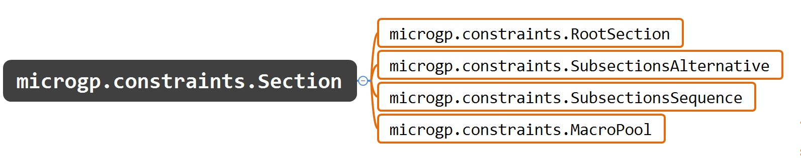

"""""""""""
Constraints
"""""""""""

.. toctree::
    :caption: Constraints
    :maxdepth: 4

The :mod:`microgp.constraints.Constraints` class contains the set of macros
and sections of which an individual is composed, the
:mod:`microgp.properties.Properties` and the function that will evaluate the
individuals (:mod:`microgp.contraints.Constraints._evaluator`).

Section
=======
A section can be of several types:

- a :mod:`microgp.constraints.MacroPool` (pool of macros)
- a :mod:`microgp.constraints.RootSection` (root section of an individual)
- a :mod:`microgp.constraints.SubsectionsSequence` (sequence of sections)
- a :mod:`microgp.constraints.SubsectionsAlternative` (sequence of sections that can be alternatively chosen)

.. autoclass:: microgp.constraints.Section
    :exclude-members: run_paranoia_checks

How a section is built
**********************

:mod:`microgp.constraints.make_section`

To build a section the following method is used:

.. automethod:: microgp.constraints.make_section

RootSection
***********

.. autoclass:: microgp.constraints.RootSection
    :exclude-members: run_paranoia_checks

MacroPool
*********

.. autoclass:: microgp.constraints.MacroPool
    :exclude-members: run_paranoia_checks

SubsectionsAlternative
**********************

.. autoclass:: microgp.constraints.SubsectionsAlternative
    :exclude-members: run_paranoia_checks

SubsectionsSequence
*******************

.. autoclass:: microgp.constraints.SubsectionsSequence
    :exclude-members: run_paranoia_checks

Properties
==========

Properties are boxes that can contain values and checkers that run tests on
the values. The testers can return True or False. Values in Properties can be
customized, for instance a value can be the number of macros in a certain
section and can be set a checker on it that checks that this values doesn't
exceed a certain threshold.

Builders can be:

- `custom_builders`: customizable by the user;

- `default_builders`: builders provided with MicroGP package.

Another distinction:

- `base_builders`: I can set a certain value;

- `cumulative_builders`: I can set a value and it can be added up recursively going through the frame tree.

This checkers are called by :mod:`microgp.individual.check_individual_validity`

:mod:`microgp.properties`

.. automodule:: microgp.properties
    :members:

Default builders
****************

:mod:`microgp.default_builders`

.. automodule:: microgp.default_builders
    :members:

